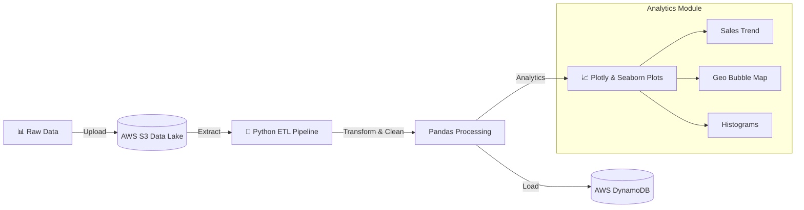
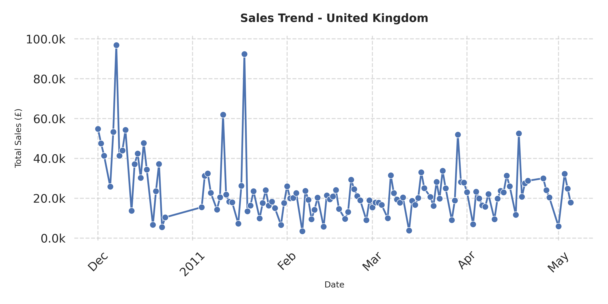

# 🚀 E-Commerce Data Pipeline & Analytics on AWS


## 📌 Proyecto Práctico
Este proyecto es una implementación profesional de **Ingeniería de Datos y Analítica Cloud** desarrollada por un **Recién Egresado de Ingeniería en Sistemas**, demostrando habilidades en integración de servicios AWS, ETL pipelines y arquitectura de software moderna.

> 🤖 **AI Collaboration**: Desarrollado en pair-programming con agentes de IA (**Cloud Opus** y **Gemini 3 Pro**) para potenciar la productividad, refinamiento de código y aplicación de mejores prácticas.

---

## 🏗️ Arquitectura del Sistema

El sistema implementa un pipeline ETL completo que ingesta datos crudos, los procesa y los sirve para analítica avanzada.



### 🛠️ Tech Stack
- **Lenguaje**: Python 3.12
- **Cloud (AWS)**:
  - **S3**: Almacenamiento de datos crudos y procesados.
  - **DynamoDB**: Base de datos NoSQL para consultas de alta velocidad.
  - **Boto3**: AWS SDK para integración programática.
- **Data & Analytics**:
  - **Pandas**: Limpieza y transformación de datos.
  - **Plotly Express**: Visualizaciones interactivas y animadas.
  - **Seaborn/Matplotlib**: Gráficos estáticos de alta calidad.
- **Arquitectura**: Clean Architecture, KISS, DRY.

---

## 🧩 Estructura Modular (Refactorizada)

El proyecto sigue principios de **Clean Architecture**, separando responsabilidades en capas claras:

```
src/
├── analityics/           # Módulo de Analítica Refactorizado
│   ├── base/             # Utilidades DRY (Config, Pagination)
│   ├── queries/          # Consultas DynamoDB optimizadas
│   └── plots/            # Generadores de visualizaciones
├── dynamodb/             # Logica de carga y conexión NoSQL
├── data_cleaning.py      # Pipeline de limpieza de datos
└── main.py               # Orquestador del pipeline
```

---

## 📊 Galería de Analítica

El sistema genera reportes visuales avanzados para la toma de decisiones:

### 1. 🌍 Mapa de Burbujas Geográfico (Animado)
Visualización interactiva que muestra la distribución global de ventas.
- **Dimensión**: Tamaño (Ventas), Color (Volumen de Ordenes).
- **Animación**: Evolución temporal por mes.


### 2. 📉 Tendencia de Ventas (UK)
Análisis temporal de ventas en el mercado principal, con ejes optimizados para legibilidad.



### 3. 📊 Distribución de Valor de Ordenes
Histograma comparativo por país para identificar patrones de consumo y ticket promedio.


---

## 🚀 Instalación y Uso

1. **Configurar Entorno**:
   ```bash
   python -m venv .venv
   source .venv/bin/activate
   pip install -r requirements.txt
   ```

2. **Variables de Entorno (.env)**:
   ```properties
   AWS_ACCESS_KEY_ID=your_key
   AWS_SECRET_ACCESS_KEY=your_secret
   AWS_REGION=us-east-1
   S3_BUCKET_NAME=your-bucket
   ```

3. **Ejecutar Pipeline**:
   ```bash
   cd src
   python main.py
   ```

---

## 💡 Aprendizajes Clave

- **Integración AWS**: Manejo programático de S3 y DynamoDB (Batch Write, Scan, Query con GSI).
- **Calidad de Datos**: Limpieza robusta con Pandas (Typing, NaN handling).
- **Refactorización**: Migración de código monolítico a módulos con responsabilidad única.
- **Visualización**: Uso de librerías modernas (Plotly) para dashboards interactivos.

---


